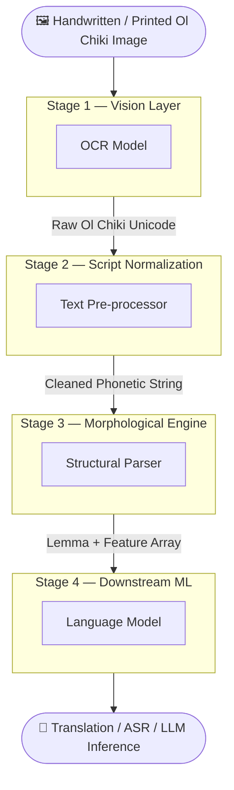

### Detailed Architectural Blueprint of the Processing Pipeline
The pipeline transforms raw optical/textual input into an optimized semantic vector through four distinct computer-implemented processing stages.

------------------------------
### Stage 1: The Vision Layer (Optical Character Recognition - OCR)
This module acts as the physical ingest engine, bridging the analog/graphical world with digital data streams.

* The Computational Input: A rasterized image array (binary pixel matrix) containing handwritten or printed Ol Chiki scripts.
* The Underlying Architecture: A hybrid Convolutional Neural Network (CNN) paired with a Bidirectional Long Short-Term Memory (BiLSTM) network, decoding sequences using a Connectionist Temporal Classification (CTC) Loss function.
* The Transformation: The CNN extracts visual spatial features from the glyph shapes (mapping the curves of letters like ᱫ, ᱟ, ᱞ). The BiLSTM analyzes horizontal character sequences to handle spacing.
* Pipeline Output: A raw, serialized array of digital Ol Chiki Unicode blocks (spanning the hex range U+1C50 to U+1C7F).

------------------------------
### Stage 2: Script Normalization and Text Interface Layer
Raw unicode text generated by OCR or keyboard input often contains noise, non-standard spelling variants, or complex diacritics that create artificial sparsity in machine learning datasets.

* The Computational Input: Serialized string array of raw Ol Chiki Unicode characters.
* The Underlying Architecture: A deterministic, rule-based algorithmic text pre-processor.
* The Transformation:
1. Diacritic Isolation: The layer scans for the Muha Tudak (nasalisation dot) and Ohcet (glottal stop modifier). Instead of allowing these modifiers to alter the base character's text string permanently, it separates them.
   2. Grapheme-to-Phoneme (G2P) Alignment: It maps the characters to a standardized phonetic string.
   3. Infix De-coupling: It applies an early regex scan across the first syllable of the string to isolate internal phonetic infixes (like ᱯ / -p-), splitting the word into a primary base matrix and a parallel secondary modifier flag.
* Pipeline Output: A pristine, standardized phonetic character string, ready for structural parsing.

------------------------------
### Stage 3: The Linguistic Engine (The Morphological Analyzer)
This is the core of your invention—the multi-tier structural parser that eliminates vocabulary explosion. It executes a hybrid fallback routing loop.

* The Computational Input: The standardized character string from Stage 2 (e.g., ᱫᱟᱞᱮᱫᱠᱳᱣᱟ / daletkoa).
* Component A: The Deterministic FST Layer: The string passes into a compiled Finite-State Transducer matrix. The system reads the string from left to right across state transition arcs. If the root ᱫᱟᱞ (dal) exists in the local embedded lexicon, the FST successfully maps the suffixes step-by-step:
* ᱫᱟᱞ → [Root=Strike]
   * ᱮᱫ → [Tense=PresCont]
   * ᱠᱳ → [Obj=AnimatePlural]
   * ᱣᱟ → [Type=FiniteMarker]
* Component B: The Exception Router: If the root word is entirely missing from the FST lexicon, a standard parser crashes. Your architecture catches this runtime exception. It preserves the known suffix arcs identified by the FST, isolates the unmapped root character block, and intercepts the data stream.
* Component C: The Neural Sequence-to-Sequence Fallback: The isolated, unmapped root block is routed to a lightweight, character-level Transformer Encoder-Decoder model. This model has been trained on synthetic agglutinative patterns to predict the boundary breaks of unknown or neologistic roots.
* Pipeline Output: A clean, standardized array consisting of a single Canonical Lemma and discrete Linguistic Feature Tags.

------------------------------
### Stage 4: Downstream Machine Learning Integration
This final stage ensures that the structural breakdown translates into optimized computational performance for your actual AI tasks (like Translation or LLM reasoning).

* The Computational Input: The Lemma and its structural Feature Tags (e.g., ᱫᱟᱞ + [PresCont] + [Obj=AnimatePlural]).
* The Underlying Architecture: A standard sub-word vocabulary tokenizer (like BPE) linked to a Large Language Model (LLM) embedding layer.
* The Transformation: Instead of forcing the LLM to learn an infinite number of raw word permutations, the tokenizer only processes the highly stable, finite vocabulary of lemmas and explicit feature tags.
* The embedding layer converts these isolated components into fixed-size dense vectors. Because the structural noise of agglutination has been stripped out, the vector space preserves near-perfect semantic relationships.
* Pipeline Output: A highly optimized, stable semantic context vector passed into the deep layers of the neural network for inference, text generation, or translation.

